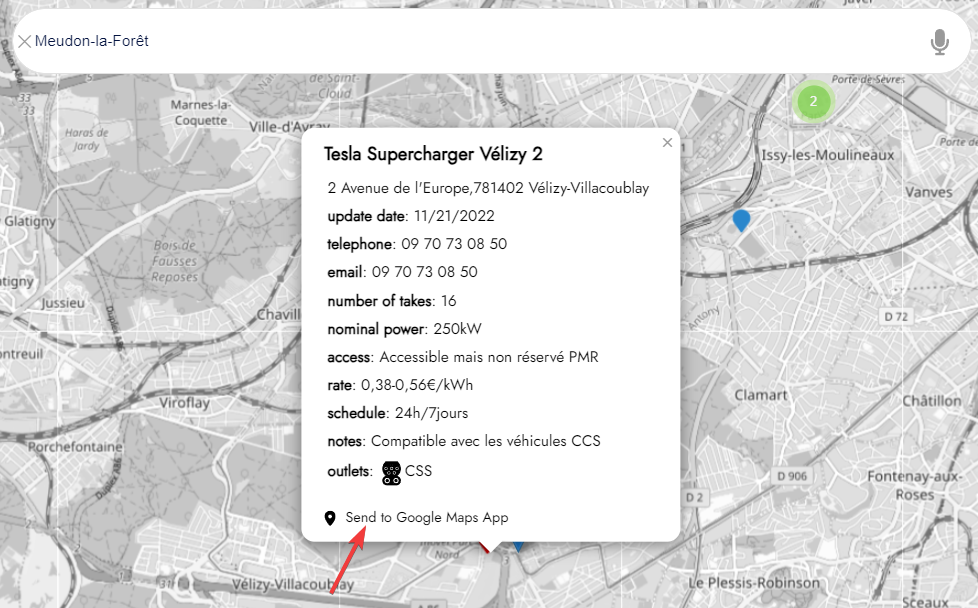

# Welcome to ES/YUSO: Your online very fast electric charging stations search service

[](changelog.md)
[](https://learn.microsoft.com/dotnet/)

[](https://ethicseido.com/Yuso/Yuso)


## **Introduction**

__ES/YUSO__ is an online electric charging station search service, which gives you access to all very fast electric charging stations. We offer an interactive map which allows you to find stations around the desired location by following a specified city or by directly browsing the map.

Our service is designed:

- to simplify your search for very fast charging stations, because during a trip, medium or fast charging stations take far too long to recharge (time greater than 2 hours), while very fast charging stations are much more efficient (time less than 45 min)
- to help you find accurate and up-to-date information.
- to make it easier for you to create routes with Google Maps.

## **How to access to ES/YUSO?**

In your favorite internet browser (chrome, brave, edge, firefox...), use the following link to access __ES/YUSO__ :

```
https://ethicseido.com/Yuso/Yuso
```

## **Getting Started**

To start using __ES/YUSO__, simply enter the city you want to find super fast charging stations in the search bar at the top center of the page.

__ES/YUSO__ is here to support you in your travels with your electric vehicle on very fast electric charging networks.

Feel free to contact us if you have any questions or comments. 

Happy electric mobility! ⚡

## **Redirecting the charging station to google maps**

With __ES/YUSO__ you can redirect a found charging station to Google Maps to easily create a route.

To do this, you must click on the desired station on the __ES/YUSO__ map then click on **Send to Google Map App** :

[](https://ethicseido.com/Yuso/Yuso)

## **Use voice search**

To use voice search, simply click on the microphone icon [](https://ethicseido.com/Yuso/Yuso) in the ES/YUSO card search bar. (If necessary, allow access to your microphone) Then Speak, you will see what you just said written in the search bar
