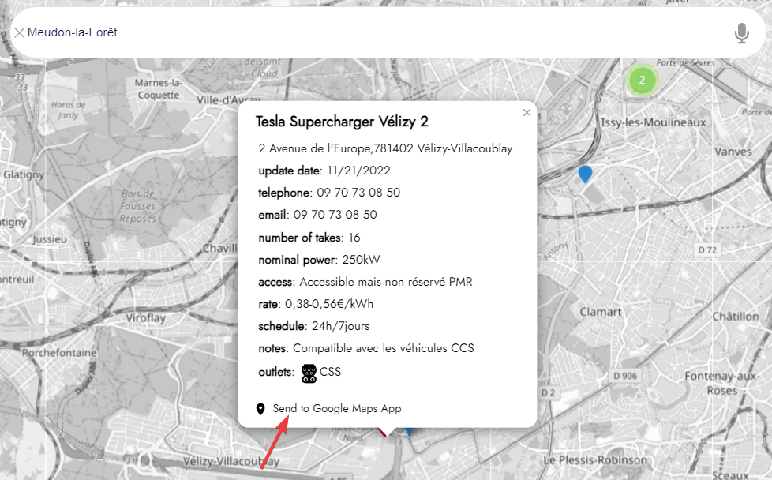

# Bienvenue sur ES/YUSO : Votre service en ligne de recherche de stations de recharge électrique ultra-rapide

[](changelog.md)
[](https://learn.microsoft.com/dotnet/)

[](https://ethicseido.com/Yuso/Yuso)

## **Introduction**

__ES/YUSO__ est un service en ligne de recherche de stations de recharge électrique, vous donnant accès à toutes les stations de recharge électrique ultra-rapides. Nous proposons une carte interactive qui vous permet de trouver des stations autour de l'emplacement souhaité en suivant une ville spécifique ou en naviguant directement sur la carte.

Notre service est conçu pour :

- simplifier votre recherche de stations de recharge ultra-rapide, car pendant un voyage, les stations de recharge moyennes ou rapides prennent beaucoup trop de temps pour se recharger (plus de 2 heures), tandis que les stations de recharge ultra-rapides sont beaucoup plus efficaces (moins de 45 minutes)
- vous aider à trouver des informations précises et à jour.
- faciliter la création de trajets avec Google Maps.

## **Comment accéder à ES/YUSO ?**

Dans votre navigateur Internet préféré (Chrome, Brave, Edge, Firefox...), utilisez le lien suivant pour accéder à __ES/YUSO__ :


```
https://ethicseido.com/Yuso/Yuso
```


## **Premiers pas**

Pour commencer à utiliser __ES/YUSO__, entrez simplement le nom de la ville dans laquelle vous souhaitez trouver des stations de recharge ultra-rapide dans la barre de recherche en haut au centre de la page.

__ES/YUSO__ est là pour vous soutenir lors de vos déplacements avec votre véhicule électrique sur les réseaux de recharge électrique ultra-rapide.

N'hésitez pas à nous contacter si vous avez des questions ou des commentaires.

Bonne mobilité électrique ! ⚡

## **Redirection de la station de recharge vers Google Maps**

Avec __ES/YUSO__, vous pouvez rediriger une station de recharge trouvée vers Google Maps pour créer facilement un itinéraire.

Pour ce faire, vous devez cliquer sur la station désirée sur la carte de __ES/YUSO__, puis cliquer sur **Envoyer vers l'application Google Maps** :

[](https://ethicseido.com/Yuso/Yuso)

## **Utiliser la recherche vocale**

Pour utiliser la recherche vocale, cliquez simplement sur l'icône du microphone [](https://ethicseido.com/Yuso/Yuso) dans la barre de recherche de la carte __ES/YUSO__. (Si nécessaire, autorisez l'accès à votre microphone) Ensuite, parlez, vous verrez ce que vous venez de dire écrit dans la barre de recherche.
